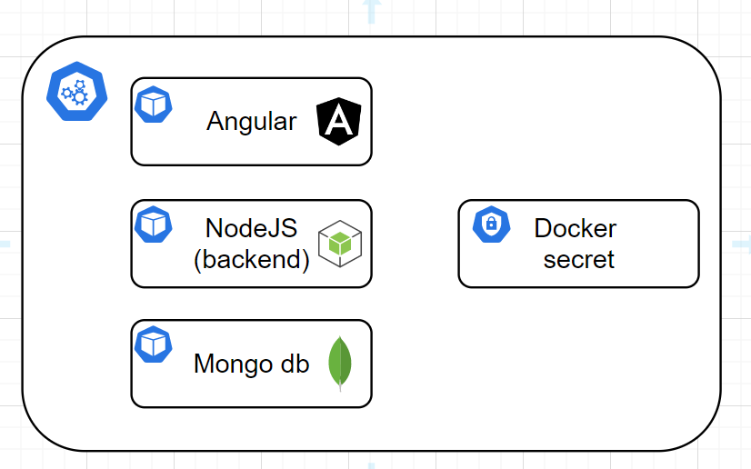

# website-deploy

> This repository is used to deploy our web application on a minikube server. 

## Architecture of the cluster

>This cluster is composed of 3 pods, our applications and a db mongo that is ready to use.
The secret that you can see has been created with the docker config that we have generated on the cluster. The secret is used to publish our docker images to a private docker repository.

## State of the cluster
>For now the angular app and the mongo db are deployed on the cluster. Each pod have a yaml configuration file that defines the ports and others stuff like the replicas. We define multiple replicas in case that the pod is down, the others are still running. 

<ins>TO DO:</ins>
- The node app configuration has been defined. The docker image works on a local usage but when it is deployed on the cluster, the command `npm install` don't work as expected.
- The angular has to be expose with an external IP with the parameter LoadBalancer or other config.
- The domain name minikube.digitalmax.fr is not reachable for now so the app is unreachable.
  
All these stuffs were not produced because of lack of time.
Here are some ressources to continue the deployment:

>[deploy node app](https://theekshanawj.medium.com/kubernetes-deploying-a-nodejs-app-in-minikube-local-development-92df31e0b037)
>[external ip](https://minikube.sigs.k8s.io/docs/handbook/accessing/)

Some useful commands: 
> Interact with the cluster and images
> - `kubectl get pod`: show the pods that are running
> - `kubectl get logs "id"`: show the logs of a particular pod
> - `kubectl get svc`: show the services that are running and their IPs
> - `kubectl get deployments`: show the deployments that are running
> - `docker build -t ideamiage/idemiage:tag` rebuild the docker image
> - `docker push ideamiage/ideamiage:tag` push the image to the repository

> Lauch mongodb:
> - `export MONGODB_ROOT_PASSWORD=$(kubectl get secret --namespace default idea-mongodb -o jsonpath="{.data.mongodb-root-password}" | base64 --decode)`
> - `kubectl run --namespace default idea-mongodb-client --rm --tty -i --restart='Never' --env="MONGODB_ROOT_PASSWORD=$MONGODB_ROOT_PASSWORD" --image docker.io/bitnami/mongodb:5.0.8-debian-10-r10 --command -- bash`
> - `mongosh admin --host "idea-mongodb" --authenticationDatabase admin -u root -p $MONGODB_ROOT_PASSWORD`

## Before deployment
> Changes rules of the firebase firestore database and replace it by:
> `// Allow read/write access on all documents to any user signed in to the application
service cloud.firestore {
  match /databases/{database}/documents {
    match /{document=**} {
      allow read, write: if request.auth != null;
    }
  }
}`
